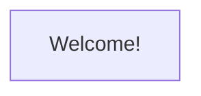

%{
    title: "Hello start table of contents",
}
---

# Course Outline

## Overview

Use the following index to find reading material and exercises for this course.

Some students experience issues displaying mermaid.js diagrams. Here's a sample diagram, which depicts the word "Welcome!" inside a box:

If you do not see the box above, or if you encounter any issues with this course, please ensure you have correctly followed the [Student Setup Guide](https://github.com/DockYard-Academy/beta_curriculum/wiki/Student-Setup-Guide) or [Report An Issue](https://github.com/DockYard-Academy/beta_curriculum/issues/new?assignees=&labels=&template=issue.md&title=) to receive help.

## Core Syntax

### Course Tools

* Reading
  
  * [Command Line](https://github.com/DockYard-Academy/beta_curriculum/blob/main/reading/command_line.livemd)
  * [Git](https://github.com/DockYard-Academy/beta_curriculum/blob/main/reading/git.livemd)
  * [Livebook](https://github.com/DockYard-Academy/beta_curriculum/blob/main/reading/livebook.livemd)
  * [Code Editors](https://github.com/DockYard-Academy/beta_curriculum/blob/main/reading/code_editors.livemd)
* Exercises
  * [Command Line Family Tree](https://github.com/DockYard-Academy/beta_curriculum/blob/main/exercises/command_line_family_tree.livemd)
  * [Livebook Recovery](https://github.com/DockYard-Academy/beta_curriculum/blob/main/exercises/livebook_recovery.livemd)
  * [GitHub Engineering Journal](https://github.com/DockYard-Academy/beta_curriculum/blob/main/exercises/github_engineering_journal.livemd)
  * [GitHub Collab](https://github.com/DockYard-Academy/beta_curriculum/blob/main/exercises/github_collab.livemd)

<!-- livebook:{"break_markdown":true} -->

### Basics

* Reading
  * [Comments](https://github.com/DockYard-Academy/beta_curriculum/blob/main/reading/comments.livemd)
  * [Arithmetic](https://github.com/DockYard-Academy/beta_curriculum/blob/main/reading/arithmetic.livemd)
  * [Strings](https://github.com/DockYard-Academy/beta_curriculum/blob/main/reading/strings.livemd)
  * [Booleans](https://github.com/DockYard-Academy/beta_curriculum/blob/main/reading/booleans.livemd)
  * [Comparison Operators](https://github.com/DockYard-Academy/beta_curriculum/blob/main/reading/comparison_operators.livemd)
  * [Match Operator](https://github.com/DockYard-Academy/beta_curriculum/blob/main/reading/match_operator.livemd)
* Exercises
  * [Fun Formulas](https://github.com/DockYard-Academy/beta_curriculum/blob/main/exercises/fun_formulas.livemd)
  * [Card Counting](https://github.com/DockYard-Academy/beta_curriculum/blob/main/exercises/card_counting.livemd)
  * [Habit Tracker](https://github.com/DockYard-Academy/beta_curriculum/blob/main/exercises/habit_tracker.livemd)
  * [Mad Libs](https://github.com/DockYard-Academy/beta_curriculum/blob/main/exercises/mad_libs.livemd)
  * Bonus: [Guessing Games](https://github.com/DockYard-Academy/beta_curriculum/blob/main/exercises/guessing_games.livemd)

<!-- livebook:{"break_markdown":true} -->

### Data Structures and Intro to Pattern Matching

* Reading
  * [Atoms](https://github.com/DockYard-Academy/beta_curriculum/blob/main/reading/atoms.livemd)
  * [Tuples](https://github.com/DockYard-Academy/beta_curriculum/blob/main/reading/tuples.livemd)
  * [Lists](https://github.com/DockYard-Academy/beta_curriculum/blob/main/reading/lists.livemd)
  * [Keyword Lists](https://github.com/DockYard-Academy/beta_curriculum/blob/main/reading/keyword_lists.livemd)
  * [Maps](https://github.com/DockYard-Academy/beta_curriculum/blob/main/reading/maps.livemd)
* Exercises
  * [Shopping List](https://github.com/DockYard-Academy/beta_curriculum/blob/main/exercises/shopping_list.livemd)
  * [Family Tree](https://github.com/DockYard-Academy/beta_curriculum/blob/main/exercises/family_tree.livemd)
  * [Mazes](https://github.com/DockYard-Academy/beta_curriculum/blob/main/exercises/mazes.livemd)

<!-- livebook:{"break_markdown":true} -->

### Control Flow and Abstraction

* Reading
  * [Functions](https://github.com/DockYard-Academy/beta_curriculum/blob/main/reading/functions.livemd)
  * [Control Flow](https://github.com/DockYard-Academy/beta_curriculum/blob/main/reading/control_flow.livemd)
* Exercises
  * [Naming Numbers](https://github.com/DockYard-Academy/beta_curriculum/blob/main/exercises/naming_numbers.livemd)
  * [Rock Paper Scissors](https://github.com/DockYard-Academy/beta_curriculum/blob/main/exercises/rock_paper_scissors.livemd)
    <!-- * Drill: [Replace `nil`s](https://github.com/DockYard-Academy/beta_curriculum/blob/main/exercises/drill-func-replace-nils.livemd) -->

<!-- livebook:{"break_markdown":true} -->

### Modules and Structs

* Reading
  * [Modules](https://github.com/DockYard-Academy/beta_curriculum/blob/main/reading/modules.livemd)
  * [Structs](https://github.com/DockYard-Academy/beta_curriculum/blob/main/reading/structs.livemd)
* Exercises
  * [Rock Paper Scissors Lizard Spock](https://github.com/DockYard-Academy/beta_curriculum/blob/main/exercises/rock_paper_scissors_lizard_spock.livemd)
  * [RPG Dialogue](https://github.com/DockYard-Academy/beta_curriculum/blob/main/exercises/rpg_dialogue.livemd)
  * Bonus: [Pokemon Battle](https://github.com/DockYard-Academy/beta_curriculum/blob/main/exercises/pokemon_battle.livemd)

<!-- livebook:{"break_markdown":true} -->

### Enumeration

* Reading
  * [Ranges](https://github.com/DockYard-Academy/beta_curriculum/blob/main/reading/ranges.livemd)
  * [Enum](https://github.com/DockYard-Academy/beta_curriculum/blob/main/reading/enum.livemd)
* Exercises
  * [FizzBuzz](https://github.com/DockYard-Academy/beta_curriculum/blob/main/exercises/fizzbuzz.livemd)
  * [Named Number Lists](https://github.com/DockYard-Academy/beta_curriculum/blob/main/exercises/named_number_lists.livemd)
  * [Counting Votes](https://github.com/DockYard-Academy/beta_curriculum/blob/main/exercises/counting_votes.livemd)
  * Bonus: [Measurements](https://github.com/DockYard-Academy/beta_curriculum/blob/main/exercises/measurements.livemd)
  * Bonus: [A Safe Range](https://github.com/DockYard-Academy/beta_curriculum/blob/main/exercises/saferange.livemd)
  * Drill: [Replace `nil`s](https://github.com/DockYard-Academy/beta_curriculum/blob/main/exercises/drill-enum1-replace-nils.livemd)

<!-- livebook:{"break_markdown":true} -->

### Comprehensions and Non-Enumerable Data Types

* Reading
  * [Enumerating on Non-Enumerables](https://github.com/DockYard-Academy/beta_curriculum/blob/main/reading/non_enumerables.livemd)
  * [Comprehensions](https://github.com/DockYard-Academy/beta_curriculum/blob/main/reading/comprehensions.livemd)
* Exercises
  * [Palindrome](https://github.com/DockYard-Academy/beta_curriculum/blob/main/exercises/palindrome.livemd)
  * [Anagram](https://github.com/DockYard-Academy/beta_curriculum/blob/main/exercises/anagram.livemd)
  * [Animal Generator](https://github.com/DockYard-Academy/beta_curriculum/blob/main/exercises/animal_generator.livemd)
  * [Book Search](https://github.com/DockYard-Academy/beta_curriculum/blob/main/exercises/book_search.livemd)
  * Drill: [Replace `nil`s](https://github.com/DockYard-Academy/beta_curriculum/blob/main/exercises/drill-enum2-replace-nils.livemd)

<!-- livebook:{"break_markdown":true} -->

### Built-in Modules

* Reading
  * [Built-In Modules](https://github.com/DockYard-Academy/beta_curriculum/blob/main/reading/built-in_modules.livemd)
* Exercises
  * [Filter Values By Type](https://github.com/DockYard-Academy/beta_curriculum/blob/main/exercises/filter_values_by_type.livemd)
  * [Tic-tac-toe](https://github.com/DockYard-Academy/beta_curriculum/blob/main/exercises/tic-tac-toe.livemd)

<!-- livebook:{"break_markdown":true} -->

### Reduce

* Reading
  * [Reduce](https://github.com/DockYard-Academy/beta_curriculum/blob/main/reading/reduce.livemd)
* Exercises
  * [Number Finder](https://github.com/DockYard-Academy/beta_curriculum/blob/main/exercises/number_finder.livemd)
  * [Weighted Voting](https://github.com/DockYard-Academy/beta_curriculum/blob/main/exercises/weighted_voting.livemd)
  * [Custom Enum With Reduce](https://github.com/DockYard-Academy/beta_curriculum/blob/main/exercises/custom_enum_with_reduce.livemd)
  * Drill: [Replace `nil`s](https://github.com/DockYard-Academy/beta_curriculum/blob/main/exercises/drill-reduce-replace-nils.livemd)

<!-- livebook:{"break_markdown":true} -->

### Dates and Time

* Reading
  * [Dates and Times](https://github.com/DockYard-Academy/beta_curriculum/blob/main/reading/datetime.livemd)
* Exercises
  * [Time Converting](https://github.com/DockYard-Academy/beta_curriculum/blob/main/exercises/time_converting.livemd)
  * [Itinerary](https://github.com/DockYard-Academy/beta_curriculum/blob/main/exercises/itinerary.livemd)
  * [Timeline](https://github.com/DockYard-Academy/beta_curriculum/blob/main/exercises/timeline.livemd)

<!-- livebook:{"break_markdown":true} -->

### Advanced Pattern Matching

* Reading
  * [Polymorphism](https://github.com/DockYard-Academy/beta_curriculum/blob/main/reading/polymorphism.livemd)
  * [Advanced Pattern Matching](https://github.com/DockYard-Academy/beta_curriculum/blob/main/reading/advanced_pattern_matching.livemd)
* Exercises
  * [Treasure Matching](https://github.com/DockYard-Academy/beta_curriculum/blob/main/exercises/treasure_matching.livemd)
  * [Rock Paper Scissors Pattern Matching](https://github.com/DockYard-Academy/beta_curriculum/blob/main/exercises/rps_pattern_matching.livemd)
  * [Metric Conversion](https://github.com/DockYard-Academy/beta_curriculum/blob/main/exercises/metric_conversion.livemd)
  * Drill: [Replace `nil`s](https://github.com/DockYard-Academy/beta_curriculum/blob/main/exercises/drill-patternmatching-replace-nils.livemd)

<!-- livebook:{"break_markdown":true} -->

### Guards

* Reading
  * [Guards](https://github.com/DockYard-Academy/beta_curriculum/blob/main/reading/guards.livemd)
* Exercises
  * [Message Validation](https://github.com/DockYard-Academy/beta_curriculum/blob/main/exercises/message_validation.livemd)
  * [Math With Guards](https://github.com/DockYard-Academy/beta_curriculum/blob/main/exercises/math_with_guards.livemd)
  * [Rock Paper Scissors Guards](https://github.com/DockYard-Academy/beta_curriculum/blob/main/exercises/rps_guards.livemd)

<!-- livebook:{"break_markdown":true} -->

### String Manipulation

* Reading
  * [Strings and Binaries](https://github.com/DockYard-Academy/beta_curriculum/blob/main/reading/strings_and_binaries.livemd)
  * [Regex](https://github.com/DockYard-Academy/beta_curriculum/blob/main/reading/regex.livemd)
* Exercises
  * [Email Validation](https://github.com/DockYard-Academy/beta_curriculum/blob/main/exercises/email_validation.livemd)
  * [Caesar Cypher](https://github.com/DockYard-Academy/beta_curriculum/blob/main/exercises/caesar_cypher.livemd)
  * [Rollable Expressions](https://github.com/DockYard-Academy/beta_curriculum/blob/main/exercises/rollable_expressions.livemd)
  * Bonus: [Phone Number Parsing](https://github.com/DockYard-Academy/beta_curriculum/blob/main/exercises/phone_number_parsing.livemd)

## Mix Projects

### Elixir Build Tooling

* Reading
  * [IEx](https://github.com/DockYard-Academy/beta_curriculum/blob/main/reading/iex.livemd)
  * [Mix](https://github.com/DockYard-Academy/beta_curriculum/blob/main/reading/mix.livemd)
  * [IO](https://github.com/DockYard-Academy/beta_curriculum/blob/main/reading/io.livemd)
* Exercises
  * [Games: Setup](https://github.com/DockYard-Academy/beta_curriculum/blob/main/exercises/games_setup.livemd)
  * [Games: Guessing Game](https://github.com/DockYard-Academy/beta_curriculum/blob/main/exercises/games_guessing_game.livemd)
  * [Games: Rock Paper Scissors](https://github.com/DockYard-Academy/beta_curriculum/blob/main/exercises/games_rock_paper_scissors.livemd)

<!-- livebook:{"break_markdown":true} -->

### Testing With ExUnit

* Reading
  * [ExUnit](https://github.com/DockYard-Academy/beta_curriculum/blob/main/reading/exunit.livemd)
* Exercises
  * [Math Module Testing](https://github.com/DockYard-Academy/beta_curriculum/blob/main/exercises/math_module_testing.livemd)
  * [Product Filters](https://github.com/DockYard-Academy/beta_curriculum/blob/main/exercises/product_filters.livemd)

<!-- livebook:{"break_markdown":true} -->

### ExUnit With Mix Projects

* Reading
  * [Elixir-lang: import](https://elixir-lang.org/getting-started/alias-require-and-import.html#import)
  * [Elixir-lang: alias](https://elixir-lang.org/getting-started/alias-require-and-import.html#alias)
  * [ExUnit With Mix](https://github.com/DockYard-Academy/beta_curriculum/blob/main/reading/exunit_with_mix.livemd)
* Exercises
  * [Games: Wordle Application](https://github.com/DockYard-Academy/beta_curriculum/blob/main/exercises/games_wordle.livemd)

<!-- livebook:{"break_markdown":true} -->

### Documentation and Static Analysis

* Reading
  * [Doctests](https://github.com/DockYard-Academy/beta_curriculum/blob/main/reading/doctests.livemd)
  * [Typespecs](https://github.com/DockYard-Academy/beta_curriculum/blob/main/reading/typespecs.livemd)
  * [ExDoc](https://github.com/DockYard-Academy/beta_curriculum/blob/main/reading/exdoc.livemd)
  * [Credo](https://github.com/DockYard-Academy/beta_curriculum/blob/main/reading/credo.livemd)
* Exercises
  * Drills: [Typespecs](https://github.com/DockYard-Academy/beta_curriculum/blob/main/exercises/typespec_drills.livemd)
  * [Games: Documentation and Static Analysis](https://github.com/DockYard-Academy/beta_curriculum/blob/main/exercises/games_documentation_and_static_analysis.livemd)

<!-- livebook:{"break_markdown":true} -->

### Executables

* Reading
  * [Executables](https://github.com/DockYard-Academy/beta_curriculum/blob/main/reading/executables.livemd)
* Exercises
  * [Games: Menu](https://github.com/DockYard-Academy/beta_curriculum/blob/main/exercises/games_menu.livemd)

## OTP and Advanced Syntax

### Protocols

* Reading
  * [Protocols](https://github.com/DockYard-Academy/beta_curriculum/blob/main/reading/protocols.livemd)
* Exercises
  * [Math With Protocols](https://github.com/DockYard-Academy/beta_curriculum/blob/main/exercises/math_with_protocols.livemd)
  * [Consumable Protocol](https://github.com/DockYard-Academy/beta_curriculum/blob/main/exercises/consumable_protocol.livemd)
  * Bonus: [Battle Map](https://github.com/DockYard-Academy/beta_curriculum/blob/main/exercises/battle_map.livemd)

<!-- livebook:{"break_markdown":true} -->

### Recursion

* Reading
  * [Recursion](https://github.com/DockYard-Academy/beta_curriculum/blob/main/reading/recursion.livemd)
* Exercises
  * [Fibonacci](https://github.com/DockYard-Academy/beta_curriculum/blob/main/exercises/fibonacci.livemd)
  * [Lucas Numbers](https://github.com/DockYard-Academy/beta_curriculum/blob/main/exercises/lucas_numbers.livemd)
  * [Factorial](https://github.com/DockYard-Academy/beta_curriculum/blob/main/exercises/factorial.livemd)
  * Bonus: [Pascals Triangle](https://github.com/DockYard-Academy/beta_curriculum/blob/main/exercises/pascals_triangle.livemd)

<!-- livebook:{"break_markdown":true} -->

### Benchmarking and Performance

* Reading
  * [Computer Hardware](https://github.com/DockYard-Academy/beta_curriculum/blob/main/reading/computer_hardware.livemd)
  * [Big O Notation](https://github.com/DockYard-Academy/beta_curriculum/blob/main/reading/big_o_notation.livemd)
  * [Benchmarking](https://github.com/DockYard-Academy/beta_curriculum/blob/main/reading/benchmarking.livemd)
* Exercises
  * [Games: Benchmarking](https://github.com/DockYard-Academy/beta_curriculum/blob/main/exercises/games_benchmarking.livemd)
  * [Custom Enum](https://github.com/DockYard-Academy/beta_curriculum/blob/main/exercises/custom_enum_with_recursion.livemd)

<!-- livebook:{"break_markdown":true} -->

### Streams

* Reading
  * [Streams](https://github.com/DockYard-Academy/beta_curriculum/blob/main/reading/streams.livemd)
* Exercises
  * Drills: [Streams](https://github.com/DockYard-Academy/beta_curriculum/blob/main/exercises/stream_drills.livemd)
  * [Lazy Product Filters](https://github.com/DockYard-Academy/beta_curriculum/blob/main/exercises/lazy_product_filters.livemd)

<!-- livebook:{"break_markdown":true} -->

### Performance Optimization

* Reading
  * [Lists and Tuples](https://github.com/DockYard-Academy/beta_curriculum/blob/main/reading/lists_vs_tuples.livemd)
  * [Maps, MapSets, and Keyword Lists](https://github.com/DockYard-Academy/beta_curriculum/blob/main/reading/maps_mapsets_keyword_lists.livemd)
* Exercises
  * [Drills: MapSets](https://github.com/DockYard-Academy/beta_curriculum/blob/main/exercises/mapset_drills.livemd)
  * [MapSet Product Filters](https://github.com/DockYard-Academy/beta_curriculum/blob/main/exercises/mapset_product_filters.livemd)
  * [Fibonacci Challenge](https://github.com/DockYard-Academy/beta_curriculum/blob/main/exercises/fibonacci_challenge.livemd)

<!-- livebook:{"break_markdown":true} -->

### Persistence Using the File System

* Reading
  * [File](https://github.com/DockYard-Academy/beta_curriculum/blob/main/reading/file.livemd)
* Exercises
  * Drills: [File](https://github.com/DockYard-Academy/beta_curriculum/blob/main/exercises/file_drills.livemd)
  * [Save Game](https://github.com/DockYard-Academy/beta_curriculum/blob/main/exercises/save_game.livemd)
  * Bonus: [File System Todo App](https://github.com/DockYard-Academy/beta_curriculum/blob/main/exercises/file_system_todo_app.livemd)
  * Bonus: [Document Tools](https://github.com/DockYard-Academy/beta_curriculum/blob/main/exercises/document_tools.livemd)
  * Mastery: [File Search](https://github.com/DockYard-Academy/beta_curriculum/blob/main/exercises/file_search.livemd)

<!-- livebook:{"break_markdown":true} -->

### Processes

* Reading
  * [Processes](https://github.com/DockYard-Academy/beta_curriculum/blob/main/reading/processes.livemd)
  * [HexDocs: Process](https://hexdocs.pm/elixir/Process.html)
* Exercises
  * Drills: [Process](https://github.com/DockYard-Academy/beta_curriculum/blob/main/exercises/process_drills.livemd)
  * [Process Mailbox](https://github.com/DockYard-Academy/beta_curriculum/blob/main/exercises/process_mailbox.livemd)

<!-- livebook:{"break_markdown":true} -->

### GenServers

* Reading
  * [Generic Server](https://github.com/DockYard-Academy/beta_curriculum/blob/main/reading/generic_server.livemd)
  * [Hexdocs: GenServer](https://hexdocs.pm/elixir/GenServer.html)
* Exercises
  * [Stack Server](https://github.com/DockYard-Academy/beta_curriculum/blob/main/exercises/stack_server.livemd)
  * [Traffic Light Server](https://github.com/DockYard-Academy/beta_curriculum/blob/main/exercises/traffic_light_server.livemd)
  * Bonus: [Pokemon Server](https://github.com/DockYard-Academy/beta_curriculum/blob/main/exercises/pokemon_server.livemd)

<!-- livebook:{"break_markdown":true} -->

### Asynchronous Messages

* Reading
  * [Asynchronous Messages](https://github.com/DockYard-Academy/beta_curriculum/blob/main/reading/async_messages.livemd)
* Exercises
  * [Mailbox Server](https://github.com/DockYard-Academy/beta_curriculum/blob/main/exercises/mailbox_server.livemd)
  * [Score Tracker](https://github.com/DockYard-Academy/beta_curriculum/blob/main/exercises/score_tracker.livemd)
  * [Timer](https://github.com/DockYard-Academy/beta_curriculum/blob/main/exercises/timer.livemd)

<!-- livebook:{"break_markdown":true} -->

### Supervisor Basics and Fault Tolerance

* Reading
  * [Supervisors](https://github.com/DockYard-Academy/beta_curriculum/blob/main/reading/supervisors.livemd)
* Exercises
  * [Supervised Stack](https://github.com/DockYard-Academy/beta_curriculum/blob/main/exercises/supervised_stack.livemd)
  * [Dominoes](https://github.com/DockYard-Academy/beta_curriculum/blob/main/exercises/dominoes.livemd)
  * [Monster Spawner](https://github.com/DockYard-Academy/beta_curriculum/blob/main/exercises/creature_spawner.livemd)

<!-- livebook:{"break_markdown":true} -->

### Testing GenServers

* Reading
  * [Testing GenServers](https://github.com/DockYard-Academy/beta_curriculum/blob/main/reading/testing_genservers.livemd)
* Exercises
  * [Stack GenServer Testing](https://github.com/DockYard-Academy/beta_curriculum/blob/main/exercises/stack.livemd)
  * [Games: Score Tracker](https://github.com/DockYard-Academy/beta_curriculum/blob/main/exercises/games_score_tracker.livemd)

<!-- livebook:{"break_markdown":true} -->

### Metaprogramming

* Reading
  * [Metaprogramming](https://github.com/DockYard-Academy/beta_curriculum/blob/main/reading/metaprogramming.livemd)
* Exercises
  * [Macro Math](https://github.com/DockYard-Academy/beta_curriculum/blob/main/exercises/macro_math.livemd)
  * [Custom Assertions](https://github.com/DockYard-Academy/beta_curriculum/blob/main/exercises/custom_assertions.livemd)

<!-- livebook:{"break_markdown":true} -->

### Mix Projects & Processes

* Reading
  * [Supervised Mix Project](https://github.com/DockYard-Academy/beta_curriculum/blob/main/reading/supervised_mix_project.livemd)
* Exercises
  * Drills: [Supervisors and GenServers](https://github.com/DockYard-Academy/beta_curriculum/blob/main/exercises/supervisor_and_genserver_drills.livemd)
  * [Games: Supervisor Setup](https://github.com/DockYard-Academy/beta_curriculum/blob/main/exercises/games_supervisor_setup.livemd)
  * [Games: Supervised Score Tracker](https://github.com/DockYard-Academy/beta_curriculum/blob/main/exercises/games_supervised_score_tracker.livemd)

<!-- livebook:{"break_markdown":true} -->

### Concurrency With Tasks

* Reading
  * [Task](https://github.com/DockYard-Academy/beta_curriculum/blob/main/reading/task.livemd)
  * [Task Supervisor](https://github.com/DockYard-Academy/beta_curriculum/blob/main/reading/task_supervisor.livemd)
* Exercises
  * Drills: [Tasks](https://github.com/DockYard-Academy/beta_curriculum/blob/main/exercises/task_drills.livemd)
  * [Concurrent Word Count](https://github.com/DockYard-Academy/beta_curriculum/blob/main/exercises/concurrent_word_count.livemd)

<!-- livebook:{"break_markdown":true} -->

### State Management With Agents and ETS

* Reading
  * [State: Agent and ETS](https://github.com/DockYard-Academy/beta_curriculum/blob/main/reading/agents_and_ets.livemd)
  * [Elixir-lang: Agents](https://elixir-lang.org/getting-started/mix-otp/agent.html)
  * [HexDocs: Agents](https://hexdocs.pm/elixir/Agent.html)
* Exercises
  * [Agent Journal](https://github.com/DockYard-Academy/beta_curriculum/blob/main/exercises/agent_journal.livemd)
  * [ETS Warehouse](https://github.com/DockYard-Academy/beta_curriculum/blob/main/exercises/inventory_management.livemd)
  * Mastery: [Advanced Score Tracker](https://github.com/DockYard-Academy/beta_curriculum/blob/main/exercises/advanced_score_tracker.livemd)

<!-- livebook:{"break_markdown":true} -->

### Rubix Cube Project

* [Rubix Cube](https://github.com/DockYard-Academy/beta_curriculum/blob/main/exercises/rubix_cube.livemd)

## Capstone Project Preparation

### Capstone Project

* Captone Project Guide

## Web Servers and Phoenix

### HTML and CSS

* Reading
  * [HTML + CSS](https://github.com/DockYard-Academy/beta_curriculum/blob/main/reading/html_css.livemd)
* Exercises
  * [Common Components](https://github.com/DockYard-Academy/beta_curriculum/blob/main/exercises/common_components.livemd)
  * Bonus: Play [FlexBox Froggy](https://flexboxfroggy.com/)
  * Bonus: Play [Grid Garden](https://cssgridgarden.com/)
  * Bonus: [Home Page](https://github.com/DockYard-Academy/beta_curriculum/blob/main/exercises/home_page.livemd)

<!-- livebook:{"break_markdown":true} -->

### APIs & Parsing JSON

* Reading
  * [APIs](https://github.com/DockYard-Academy/beta_curriculum/blob/main/reading/apis.livemd)
* Exercises
  * [Spoonacular Recipe API](https://github.com/DockYard-Academy/beta_curriculum/blob/main/exercises/spoonacular_recipe_api.livemd)
  * Mastery: [Pokemon API](https://github.com/DockYard-Academy/beta_curriculum/blob/main/exercises/pokemon_api.livemd)

<!-- livebook:{"break_markdown":true} -->

### Phoenix

* Reading
  * [Web Servers](https://github.com/DockYard-Academy/beta_curriculum/blob/main/reading/web_servers.livemd)
  * [HexDocs: Phoenix Up and Running](https://hexdocs.pm/phoenix/up_and_running.html)
  * [Phoenix 1.6](https://github.com/DockYard-Academy/beta_curriculum/blob/main/reading/phoenix_1.6.livemd)
  * Bonus: [Phoenix 1.7](https://github.com/DockYard-Academy/beta_curriculum/blob/main/reading/phoenix_1.7.livemd)
* Exercises
  * Drills: [Phoenix](https://github.com/DockYard-Academy/beta_curriculum/blob/main/exercises/phoenix_drills.livemd)
  * [In-Memory TodoList](https://github.com/DockYard-Academy/beta_curriculum/blob/main/exercises/in-memory_todo_list.livemd)

<!-- livebook:{"break_markdown":true} -->

### Tailwind

* Reading
  * [Tailwind](https://github.com/DockYard-Academy/beta_curriculum/blob/main/reading/tailwind.livemd)
  * [Phoenix + Tailwind Installation Guide](https://tailwindcss.com/docs/guides/phoenix)
* Exercises
  * [Tailwind CSS Components](https://github.com/DockYard-Academy/beta_curriculum/blob/main/exercises/tailwind_css_components.livemd)
  * Mastery: [Portfolio](https://github.com/DockYard-Academy/beta_curriculum/blob/main/exercises/portfolio.livemd)

<!-- livebook:{"break_markdown":true} -->

### Ecto Changesets

* Reading
  * [Ecto Changeset](https://github.com/DockYard-Academy/beta_curriculum/blob/main/reading/ecto_changeset.livemd)
* Exercises
  * [Sign Up Form](https://github.com/DockYard-Academy/beta_curriculum/blob/main/exercises/sign_up_form.livemd)
  * Bonus: [Book Changeset](https://github.com/DockYard-Academy/beta_curriculum/blob/main/exercises/book_changeset.livemd)

<!-- livebook:{"break_markdown":true} -->

### Phoenix and Ecto

* Reading
  * [Relational Database Management Systems](https://github.com/DockYard-Academy/beta_curriculum/blob/main/reading/rdbms.livemd)
  * [Phoenix and Ecto](https://github.com/DockYard-Academy/beta_curriculum/blob/main/reading/phoenix_and_ecto.livemd)
* Exercises
  * [Drills: SQL Queries](https://github.com/DockYard-Academy/beta_curriculum/blob/main/exercises/sql_drills.livemd)
  * [Blog: Posts](https://github.com/DockYard-Academy/beta_curriculum/blob/main/exercises/blog_posts.livemd)

<!-- livebook:{"break_markdown":true} -->

### Testing Phoenix

* Reading
  * [Phoenix: Introduction to Testing](https://hexdocs.pm/phoenix/testing.html)
  * [BookSearch: Authors](https://github.com/DockYard-Academy/beta_curriculum/blob/main/reading/book_search_authors.livemd)
* Exercises
  * [Blog: Search](https://github.com/DockYard-Academy/beta_curriculum/blob/main/exercises/blog_search.livemd)

<!-- livebook:{"break_markdown":true} -->

### Schemas and Migrations

* Reading
  * [Schemas and Migrations](./https://github.com/DockYard-Academy/beta_curriculum/blob/main/reading/schemas_and_migrations.livemd)
* Exercises
  * [Blog: Migration](./https://github.com/DockYard-Academy/beta_curriculum/blob/main/exercises/blog_migration.livemd)

<!-- livebook:{"break_markdown":true} -->

### Phoenix and Ecto One-to-Many Associations

* Reading
  * [BookSearch: Books](https://github.com/DockYard-Academy/beta_curriculum/blob/main/reading/book_search_books.livemd)
* Exercises
  * [Blog: Comments](https://github.com/DockYard-Academy/beta_curriculum/blob/main/exercises/blog_comments.livemd)

<!-- livebook:{"break_markdown":true} -->

### Seeding

* Reading
  * [BookSearch: Seeding](https://github.com/DockYard-Academy/beta_curriculum/blob/main/reading/book_search_seeding.livemd)
* Exercises
  * [Blog: Seeding](https://github.com/DockYard-Academy/beta_curriculum/blob/main/exercises/blog_seeding.livemd)

<!-- livebook:{"break_markdown":true} -->

### Phoenix Forms

* Reading
  * [BookSearch: Book Form](https://github.com/DockYard-Academy/beta_curriculum/blob/main/reading/book_search_book_form.livemd)
* Exercises
  * [Blog: Comment Form](https://github.com/DockYard-Academy/beta_curriculum/blob/main/exercises/blog_comment_form.livemd)

<!-- livebook:{"break_markdown":true} -->

### Phoenix Authentication

* Reading
  * [Phoenix Authentication](https://github.com/DockYard-Academy/beta_curriculum/blob/main/reading/phoenix_authentication.livemd)
* Exercises
  * [Blog: Authentication](https://github.com/DockYard-Academy/beta_curriculum/blob/main/exercises/blog_authentication.livemd)

<!-- livebook:{"break_markdown":true} -->

### Phoenix and Ecto Many-to-Many Relationships

* Reading
  * [BookSearch: Tags](https://github.com/DockYard-Academy/beta_curriculum/blob/main/reading/book_search_tags.livemd)
* Exercises
  * [Blog: Tags](https://github.com/DockYard-Academy/beta_curriculum/blob/main/exercises/blog_tags.livemd)

<!-- livebook:{"break_markdown":true} -->

### Phoenix and Ecto One-to-One Relationships

* Reading
  * [BookSearch: Book Content](https://github.com/DockYard-Academy/beta_curriculum/blob/main/reading/book_search_book_content.livemd)
* Exercise
  * [Blog: Blog Content](https://github.com/DockYard-Academy/beta_curriculum/blob/main/exercises/blog_content.livemd)

<!-- livebook:{"break_markdown":true} -->

### Deployment

* Reading
  * [BookSearch: Deployment](https://github.com/DockYard-Academy/beta_curriculum/blob/main/reading/book_search_deployment.livemd)
* Exercise
  * Bonus: [Blog: Deployment](https://github.com/DockYard-Academy/beta_curriculum/blob/main/exercises/deployment.livemd)

## LiveView

### LiveView

* Reading
  * [LiveView Counter](https://github.com/DockYard-Academy/beta_curriculum/blob/main/reading/liveview.livemd)
* Exercises
  * [Math Game](https://github.com/DockYard-Academy/beta_curriculum/blob/main/exercises/math_game.livemd)

<!-- livebook:{"break_markdown":true} -->

### LiveView & Ecto

* Instruction
  * [PicChat: Messages](https://github.com/DockYard-Academy/beta_curriculum/blob/main/reading/pic_chat_messages.livemd)

<!-- livebook:{"break_markdown":true} -->

### LiveView Image Uploads

* Instruction
  * [PicChat: Image Upload](https://github.com/DockYard-Academy/beta_curriculum/blob/main/reading/pic_chat_image_upload.livemd)

<!-- livebook:{"break_markdown":true} -->

### PubSub

* Instruction
  * [PicChat: PubSub](https://github.com/DockYard-Academy/beta_curriculum/blob/main/reading/pic_chat_pub_sub.livemd)

<!-- livebook:{"break_markdown":true} -->

### LiveView JS Interoperability and Pagination

* Instruction
  * [PicChat: Infinite Scroll](https://github.com/DockYard-Academy/beta_curriculum/blob/main/reading/pic_chat_infinite_scroll.livemd)

<!-- livebook:{"break_markdown":true} -->

### GraphQL and Absinthe

* Reading
  * GraphQL
  * Absinthe
* Exercises
  * Recipe App
  * Music Search App w/ GraphQL

## External Libraries

### Emailing & Swoosh

* Reading
* Exercises
  * Portfolio: Contact Form

## Final Project

### Demo Day

* Demo Day Preparation